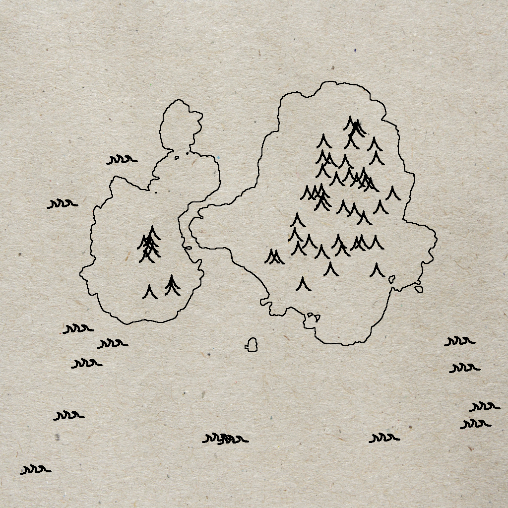
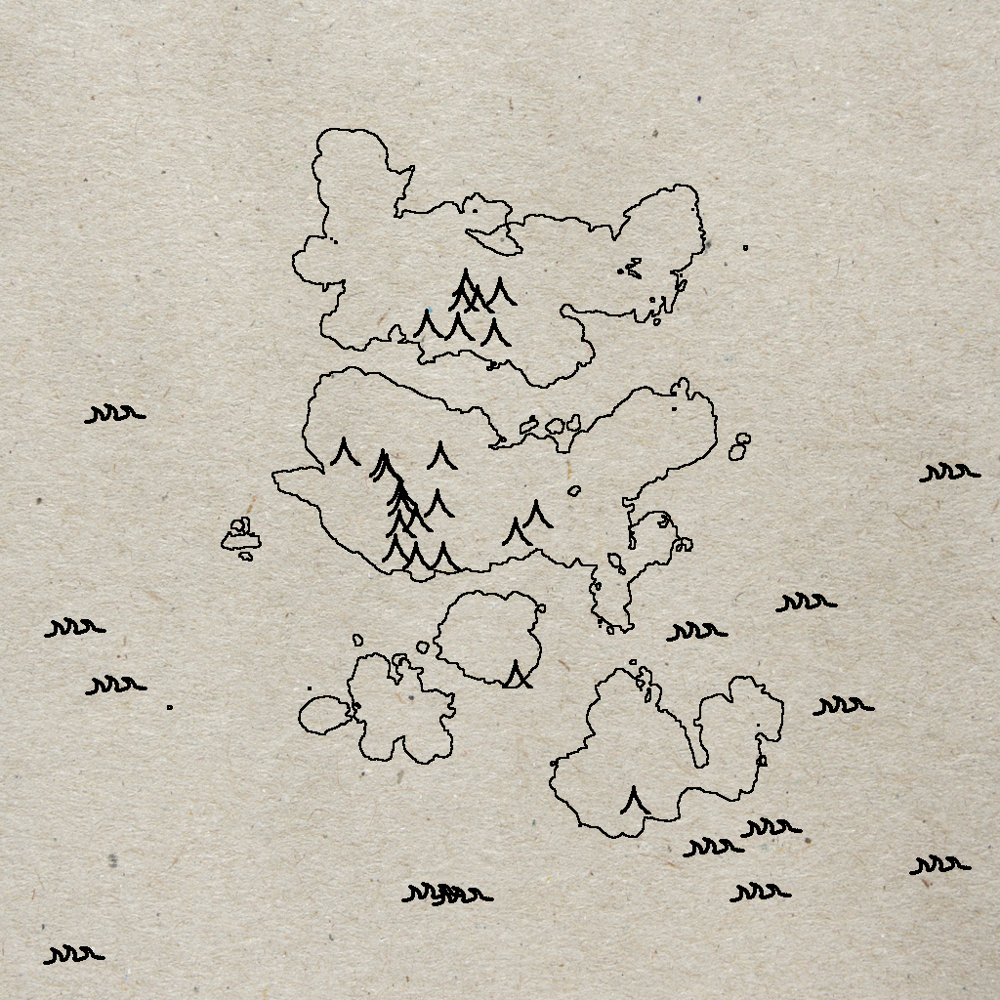
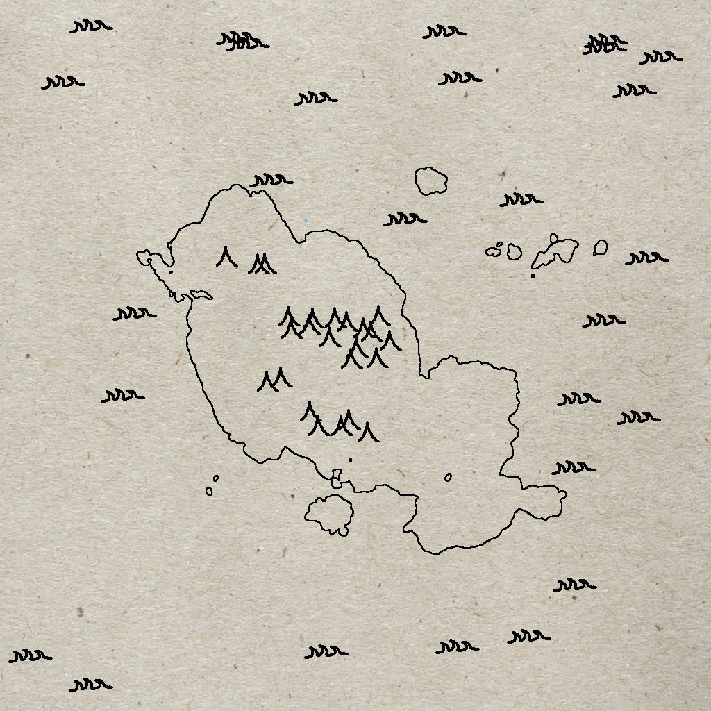
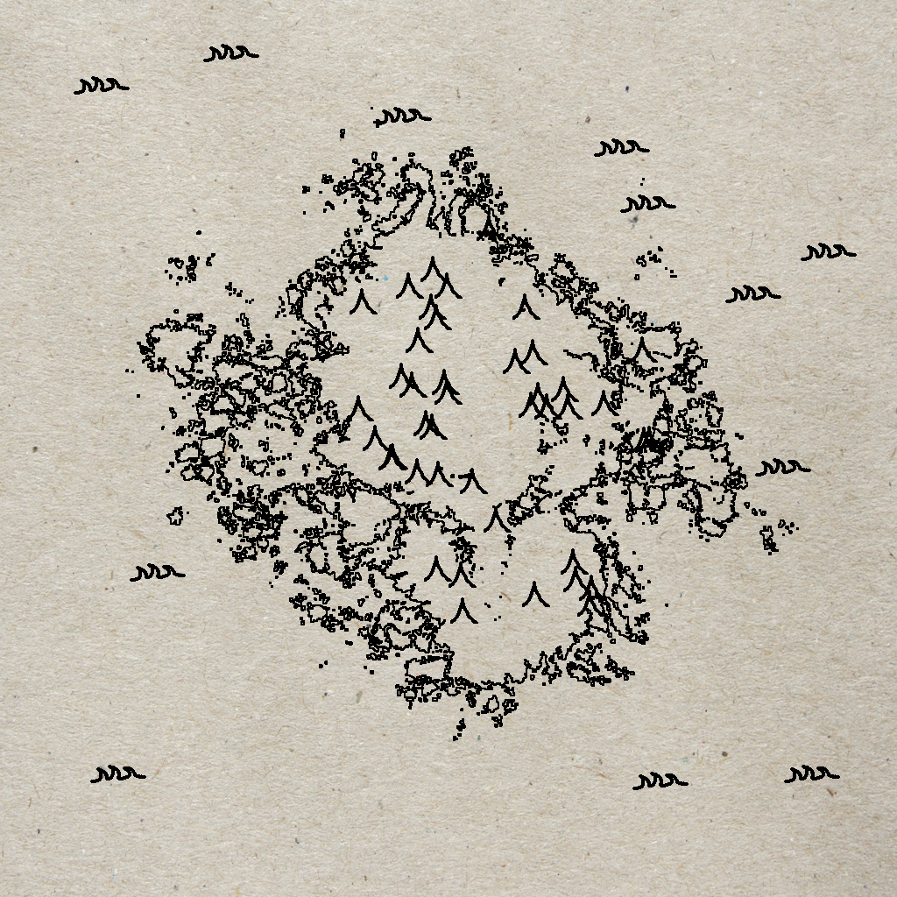
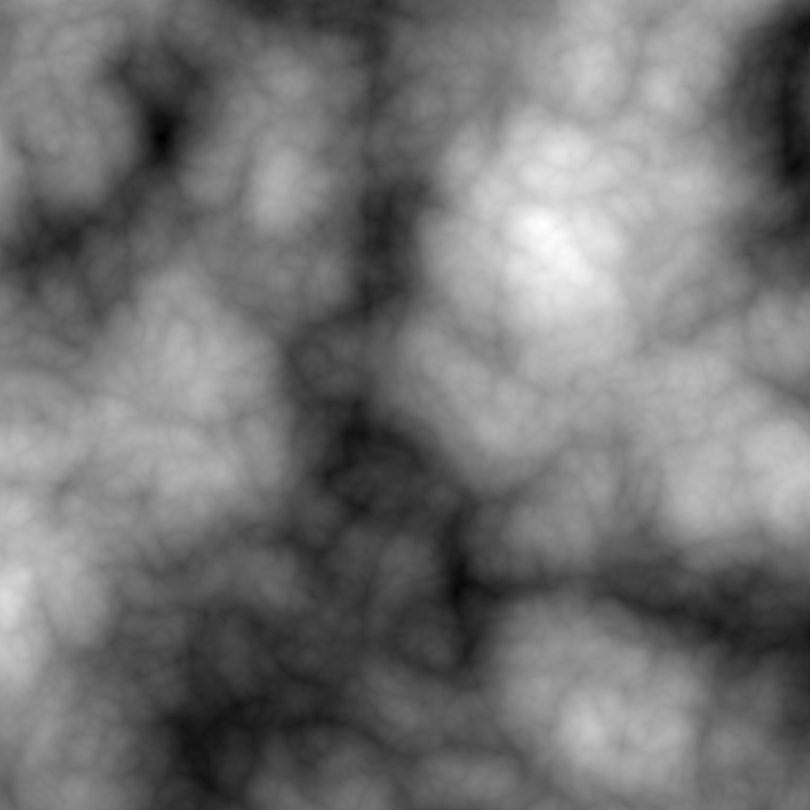
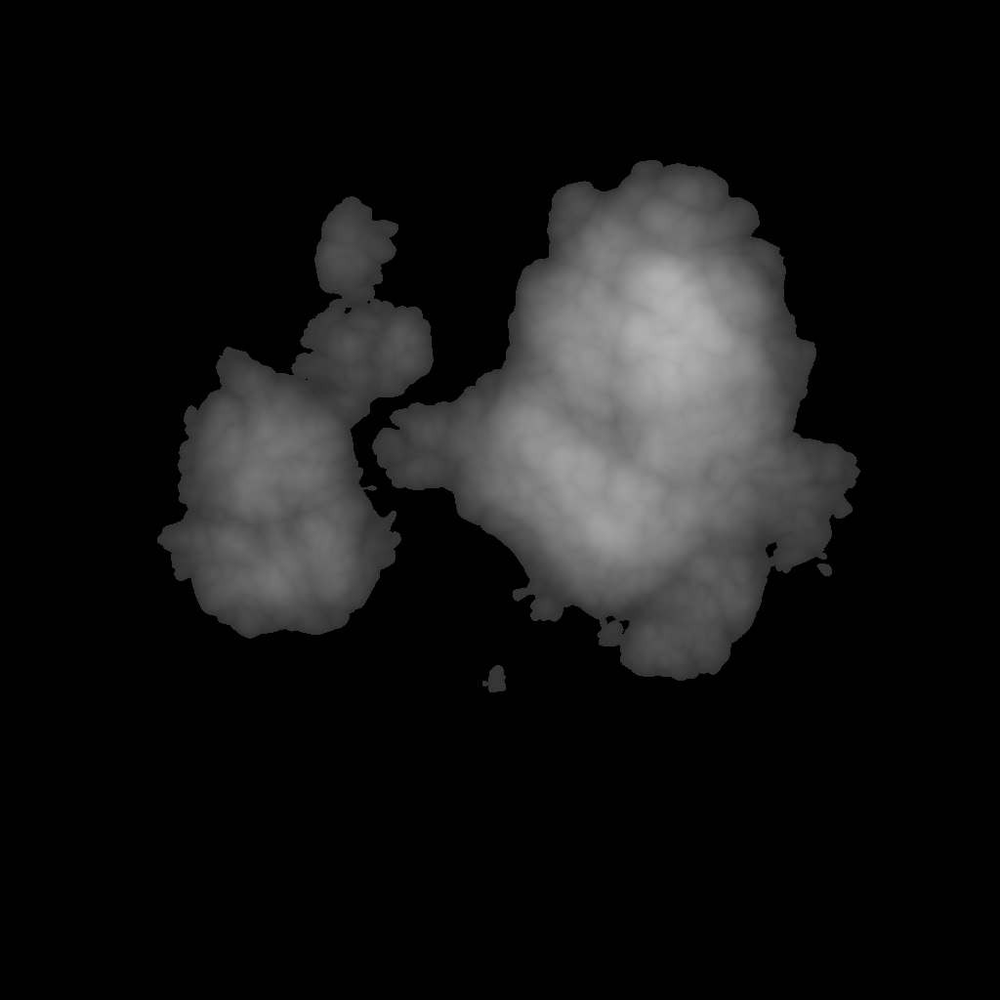
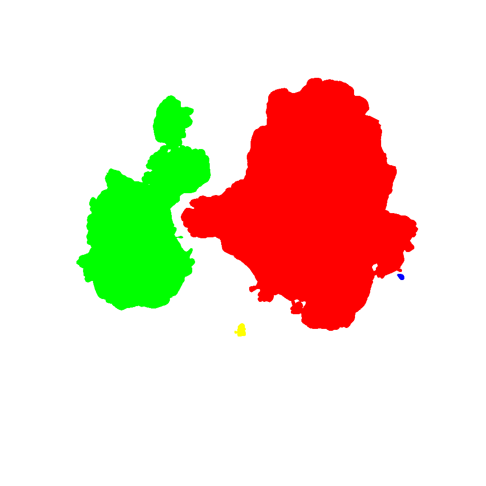
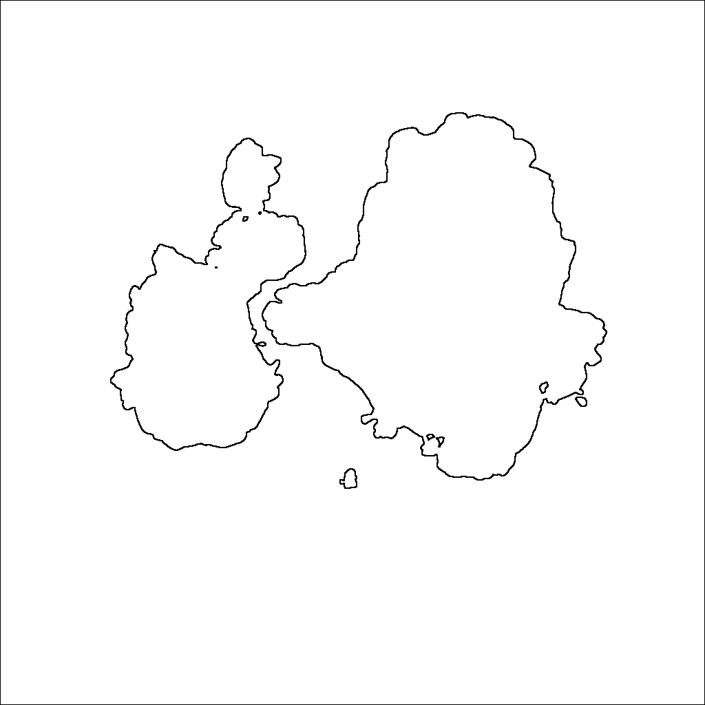

# MapGen

Procedurally generate stylized maps
---
## Installation

Clone or download the repository, then run `make` in the root directory.

## Use

Run `MapGen` to use the default settings, or run `MapGen -c` to alter settings.

---

## Examples

---

## Progress Pictures

Raw open simplex noise height map

Height map with values below a threshold cut off

Islands colored to find distinct landmasses

Islands outlined around their edges

Final product

